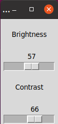

# ddccontrol-gui

GUI for changing brightness/contrast of the Display on linux (because I found gddccontrol too clunky). This is what it looks like:



Currently it supports only my display. Please indicate if you are interested in extending this.

## Installation

### Dependencies

```
sudo apt install ddccontrol
sudo apt install python3-tk
```

### Access i2c without sudo

Replace `/dev/i2c-1` with the address of your device (see `ddccontrol -p`)

```
I2C_DEVICE=/dev/i2c-1
sudo su
groupadd i2c
chown :i2c $I2C_DEVICE
chmod g+rw $I2C_DEVICE
usermod -aG i2c $USER
echo 'KERNEL=="i2c-[0-9]*", GROUP="i2c"' >> /etc/udev/rules.d/10-local_i2c_group.rules
```

### Launcher

Modify `brightness.desktop` and copy it to `/usr/share/applications/`.
